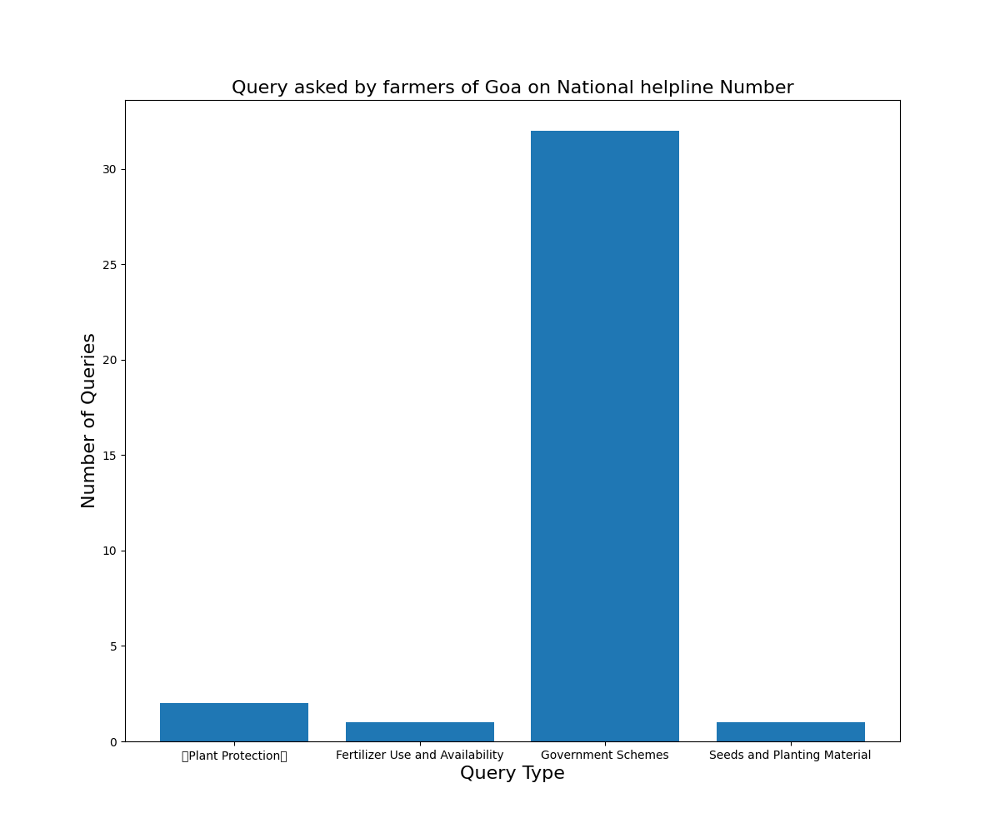
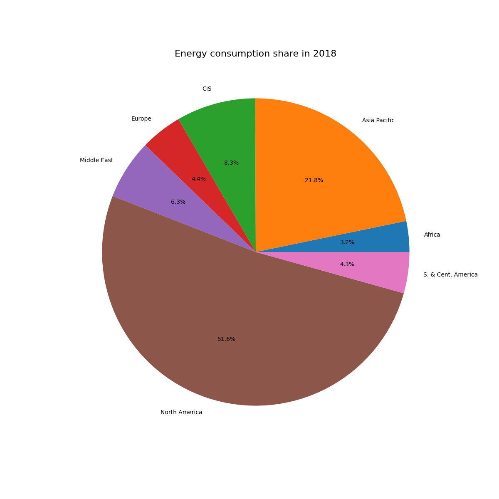
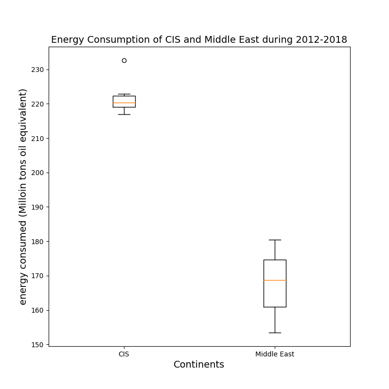
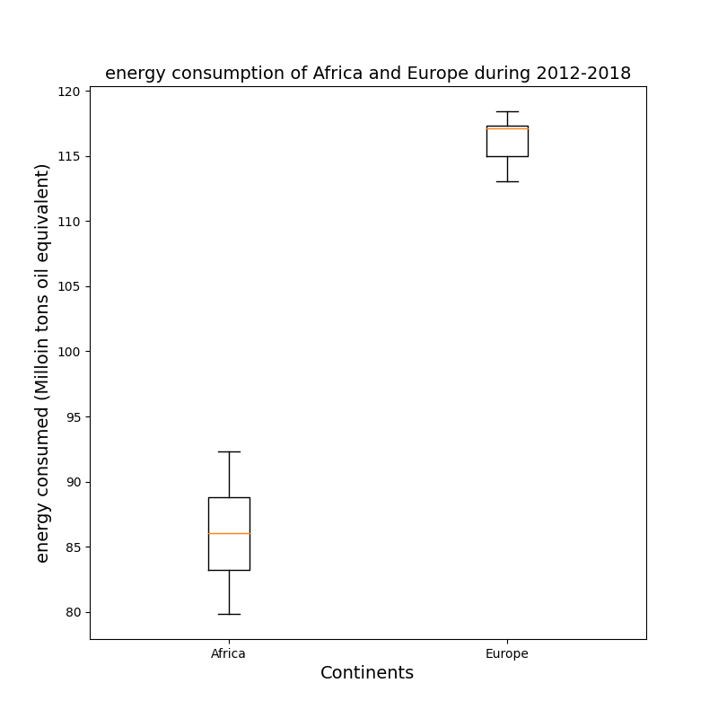
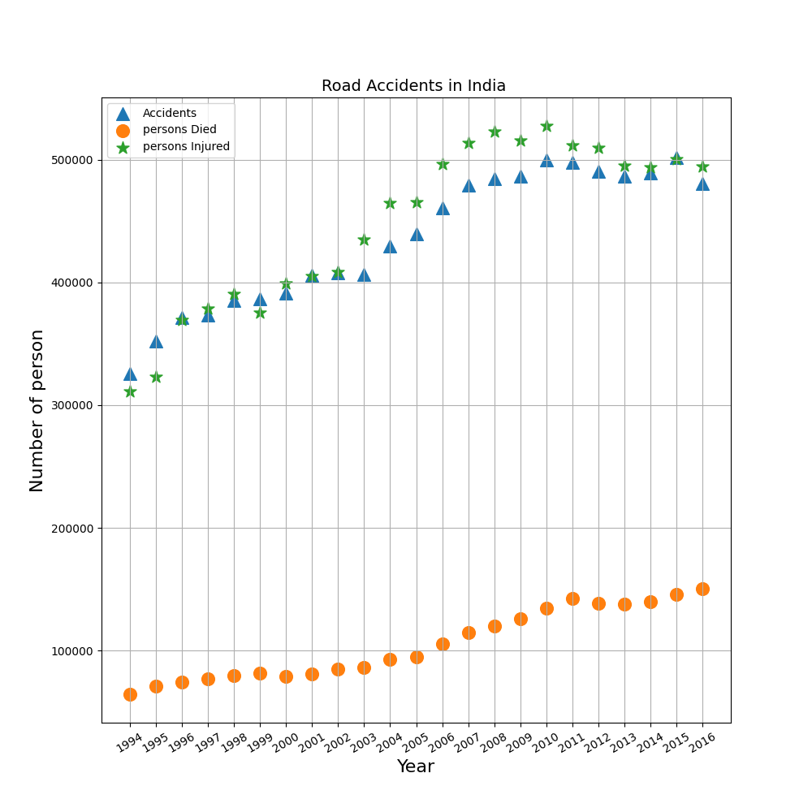

# Data Visualization

### Bar plot 
<!--  -->

In the Bar-Plot We can see how many question were asked about which topic by the farmers of GOA on the kishan helpline number

[Farmers Queries in Kisan Call Centre (KCC) from GOA NORTH district of GOA for the month of January 2020](https://data.gov.in/resources/farmers-queries-kisan-call-centre-kcc-goa-north-district-goa-month-january-2020)

### Pie chart 
<!--  -->

From the Pie-Plot We can infer about what % of enrgy is used by which continents from the pie chart above.

[Primary Energy Consumption in Select Countries of the World from 2012 to 2018](https://data.gov.in/resources/primary-energy-consumption-in-select-countries-of-the-world-from-2012-)

### Box-plot
<!--  -->
<!--  -->

In the Box-plot1 and Box-plot2 We can check the distribution of energy consumption from 2012-2018 for continents and how much their needs vary anuuanly.

[Primary Energy Consumption in Select Countries of the World from 2012 to 2018](https://data.gov.in/resources/primary-energy-consumption-in-select-countries-of-the-world-from-2012-)

### Scatter Plot
<!--  -->

We can observe from the scatter that the number of people killed, injured and total number of accidents happend in india during the gievn years. 

[Road Accidents, Persons Killed and Injured from 1970 to 2017](https://data.gov.in/resources/road-accidents-persons-killed-and-injured-1970-2017)

### Refrences

1. [https://data.gov.in/resources/primary-energy-consumption-in-select-countries-of-the-world-from-2012-](https://data.gov.in/resources/primary-energy-consumption-in-select-countries-of-the-world-from-2012-)
2. [https://data.gov.in/resources/farmers-queries-kisan-call-centre-kcc-goa-north-district-goa-month-january-2020](https://data.gov.in/resources/farmers-queries-kisan-call-centre-kcc-goa-north-district-goa-month-january-2020)
3. [https://data.gov.in/resources/road-accidents-persons-killed-and-injured-1970-2017](https://data.gov.in/resources/road-accidents-persons-killed-and-injured-1970-2017) 

[Energy]: https://data.gov.in/resources/primary-energy-consumption-in-select-countries-of-the-world-from-2012-
[Farmer]: https://data.gov.in/resources/farmers-queries-kisan-call-centre-kcc-goa-north-district-goa-month-january-2020
[Road]: https://data.gov.in/resources/road-accidents-persons-killed-and-injured-1970-2017